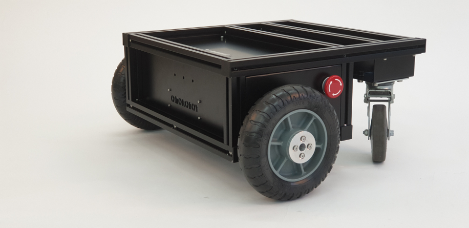
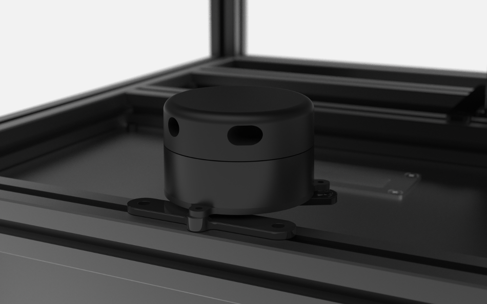
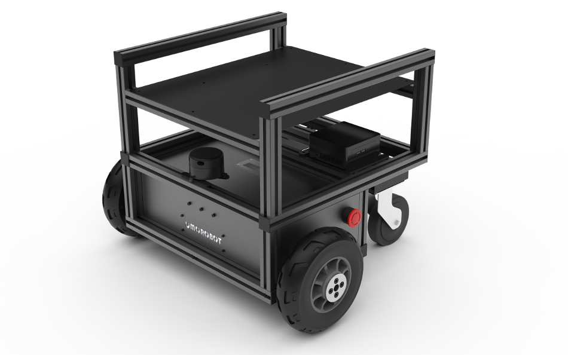
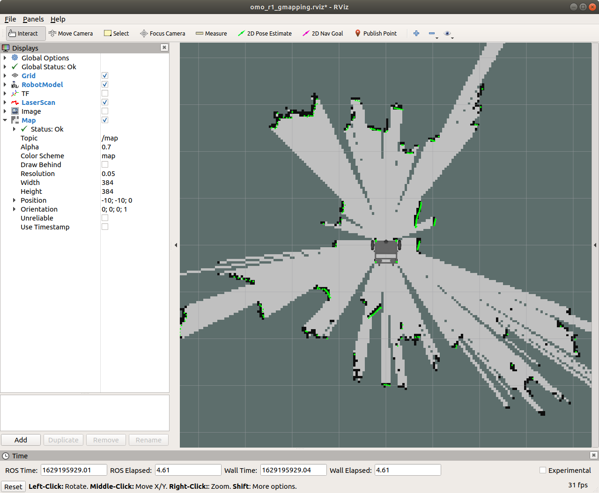
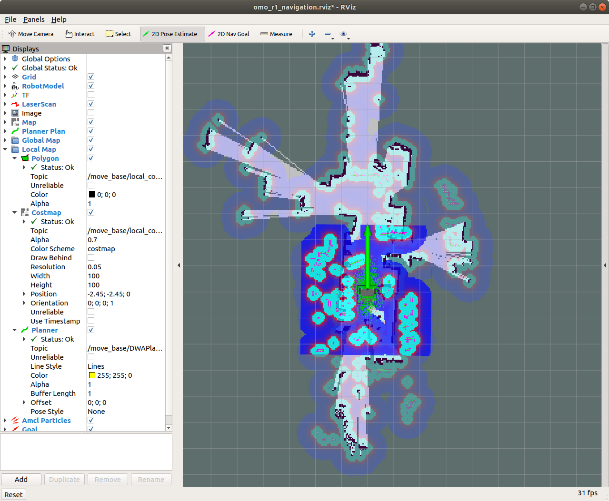

# OMOROBOT *R1* ROS package

Melodic Version

author : PinkWink
Maintainer : Kyu

Official ros package for OMO R1 robot. The original source has been released https://github.com/omorobot/omoros  

<div align="left">
  
</div>
This project is about ROS Package for OMOROBOT's R1 mid-size mobile robot platform.  

## Overview

다음은 R1 대표 이미지 이며 [오모로봇 네이버스토어](https://smartstore.naver.com/omorobot/products/3975771394)에서 구매하실 수 있습니다.  

Below image represents R1 which can be purchased from [Omorobot Hompage](https://omorobot.com/product/r1/).
<div align="center">
  
</div>

한글 튜토리얼 깃북은 다음 페이지를 참조하세요.
[https://omorobot.gitbook.io/manual/product/omo-r1/ros-1](https://omorobot.gitbook.io/manual/product/omo-r1/ros-1)

English version tutorial will be available soon.  

## Installation

This package assumes R1 is equipped with ydlidar G2 on top of the platform facing forward as below picture.  

<div align="center">
  
</div>

Below image represents R1-SLAM version we developped for SLAM navigation.  

<div align="center">
  
</div>

A PC mounted on the robot is running ubuntu 18.04 and has ROS-melodic version installed.  

Simply git clone this project under your catkin workspace folder as below.

```
$ cd ~/catkin_ws/src
$ git clone https://github.com/omorobot/omo_r1
```

## Additional packages

Below pacakges are required to run this package and are located in ROBOT's **catkin_ws/src** folder
- https://github.com/YDLIDAR/ydlidar_ros to run ydlidar G2


## Dependency

In order to run all the packages included in this project, you may need to install additional ROS packages as below.

```
sudo apt-get install ros-melodic-tf ros-melodic-joy \
ros-melodic-teleop-twist-joy \
ros-melodic-teleop-twist-keyboard \
ros-melodic-laser-proc ros-melodic-rgbd-launch \
ros-melodic-depthimage-to-laserscan \
ros-melodic-rosserial-arduino ros-melodic-rosserial-python \
ros-melodic-rosserial-server ros-melodic-rosserial-client \
ros-melodic-rosserial-msgs ros-melodic-amcl \
ros-melodic-map-server ros-melodic-move-base \
ros-melodic-urdf ros-melodic-xacro ros-melodic-usb-cam \
ros-melodic-compressed-image-transport \
ros-melodic-rqt-image-view ros-melodic-gmapping \
ros-melodic-navigation ros-melodic-interactive-markers \
ros-melodic-ar-track-alvar ros-melodic-ar-track-alvar-msgs 
```

## Running the Robot

To simply run the robot to control with teleop keyboard command, enter below while roscore is running in the **HOST PC**

```
$ roslaunch omo_r1_bringup omo_r1_motor.launch
$ roslaunch omo_r1_teleop omo_r1_teleop_key.launch
```
This allows you to move the robot simply by keyboard input as
- W: Move FWD (Increase lin_vel.x)
- A: Turn Left (Increase rot_vel.z)
- S: Stop (Reset lin_vel.x, rot_vel.z)
- D: Turn Right (Decrease rot_vel.z)
- X: Move REV (Decrease lin_vel.x)

## SLAM Mapping
<div align="center">
  
</div>

To run 2D lidar based SLAM navigation, simply launch below in ROBOT.  

```
$ roslaunch omo_r1_bringup omo_r1_robot_G2.launch
$ roslaunch omo_r1_slam omo_r1_slam_G2.launch
```

Launch below in HOST PC to open rviz environment to make map.  
```
$ roslaunch omo_r1_slam omo_r1_slam_rviz.launch
$ roslaunch omo_r1_teleop omo_r1_teleop_key.launch
```

Move the robot using keyboard input (W: FWD, A: Left, D: Right, X: REV) and map will be expanded as it go.
Once map is fully generated, enter below to save **map.yaml** and **map.pgm** files.

```
$ rosrun map_server map_saver -f map
```
Terminate all nodes and copy these files and place into ROBOT's *~/catkin_ws/src/omo_r1mini/omo_r1mini_navigation/maps* 

## SLAM Navigation

<div align="center">
  
</div>

To start SLAM navigation launch below in ROBOT.  

```
$ roslaunch omo_r1_bringup omo_r1_robot.launch
$ roslaunch omo_r1_navigation omo_r1_navigation_G2.launch
```
Then launch below in HOST PC to open the robot in rviz environment.  
```
$ roslaunch omo_r1_navigation_G2 omo_r1_navigation_rviz.launch
```

Place the robot in the map by selecting green arrow(**2D Pose Estimate**) in the top menu and **pick**(Location) and **drag**(direction) where the robot likely to be and its direction in the map.

Now place a **goal** by selecting Pink arrow(**2D Nav Goal**) in the top menu and **pick**(Goal location) and **drag**(Goal direction) where the robot should go in the map.

Wait until the robot reaches the goal!

---

OMOROBOT INC